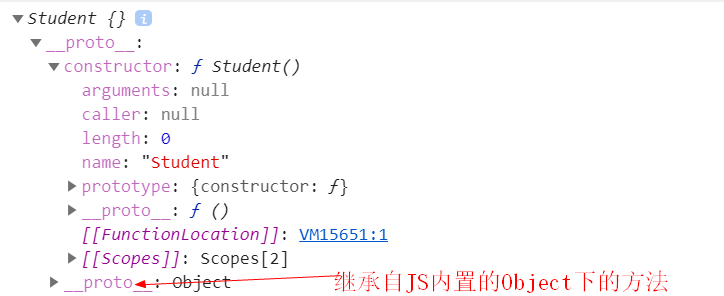

# [你好](https://www.baidu.com)
## 你好
### 你好
#### 你好
###### 你好
##### 你好
####### 你好

引用: 
> 你好
> 你好

分隔符

你好你好
------
你好
***

列表

- 1.你好
  * 嘿嘿
    - 哈哈
    - 哈哈
    - 哈哈
  * 嘿嘿
  * 嘿嘿
- 2.你好
- 3.你好

* 4.你好
* 5.你好
+ 6.你好

链接(可以是相对路径也可以是绝对路径)

[百度](https://www.baidu.com)

[new操作符](./../JavaScript/01JS的new操作符.md)

图片



代码片段
```js
var str = "hello wrold";
```

字体样式

*斜体*
**加粗**
***斜体加粗***

表格

表头1|表头2|表头3
:-------------|:----:|-------------:
左对齐|居中对齐|右对齐


